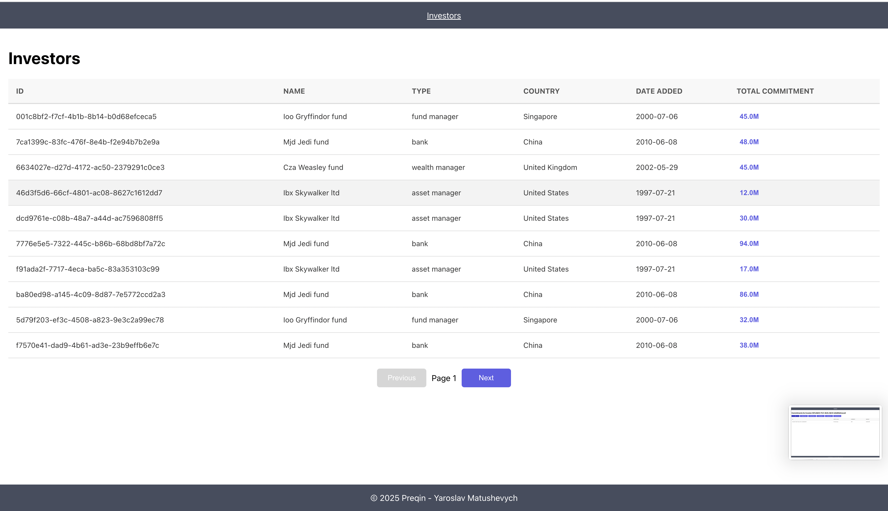
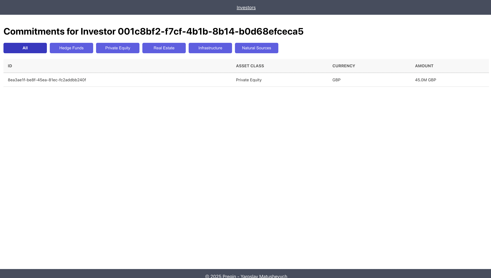

# 📊 Preqin Technical Interview

Hello! 👋  
Welcome to my solution for the **Preqin Technical Interview**. This project fulfills the user story provided, showcasing how I approach problem-solving and software development. Below, you'll find details about the solution and how to run the application. 🚀

---

## 📝 User Story

The solution is based on the following user story:

As a Preqin user, I want to see a list of investors and the total of their commitments. When I select an investor, I want to see a breakdown of their commitments And be able to filter them by Asset Class.

---

## 🛠 Solution Overview

The solution comprises three key layers:

### 1. **Data Layer**
- **Storage**: The provided `data.csv` file is parsed and loaded into an in-memory data structure to simplify the setup process.
- **Data Transformation**: The data is transformed into a structured format with investor commitments tied to unique investor IDs.

### 2. **Backend Services**
- **Framework**: Built with **FastAPI** for handling API requests.
- **Endpoints**:
  - `/investors`: Provides a list of investors along with their total commitments.
  - `/commitments/{investor_id}`: Returns a detailed breakdown of commitments for a specific investor with optional filtering by Asset Class.

### 3. **Web Application**
- **Frontend Framework**: Built with **React** and **TypeScript**.
- **UI Features**:
  - Displays a list of investors with their total commitments.
  - Allows users to click on an investor to view detailed commitment data.
  - Provides filtering options by Asset Class for better data exploration.

---

## 🚀 Getting Started

Follow these steps to set up and run the project locally:

### 1. Install Dependencies
Install the dependencies for both the client and server:
```bash
npm run install:all
```

### 2. Start the Application
Run both the client and server simultaneously:

```bash
npm run start:all
```

### 3. Access the Application
Open your browser and navigate to http://localhost:3000 to access the client.
The server runs at http://localhost:8000 and provides API endpoints.

---

## 🛠 Features

This project satisfies the following technical requirements:

1. **Data Layer**:
   - Efficiently stores and organizes data parsed from the provided `data.csv` file.
   - Processes investor and commitment information for easy retrieval and display.

2. **Backend Services**:
   - Provides data to consumers via a REST API.
   - Implements endpoints to fetch a list of investors, their total commitments, and detailed commitment data for a selected investor.

3. **Web Application**:
   - Consumes the backend API to display data on a responsive UI.
   - Implements filtering functionality for commitments by Asset Class.
   - Visualizes the data in a clear and user-friendly format.

4. **Tech Stack Familiarity**:
   - Utilizes React and TypeScript for the frontend.
   - Implements a FastAPI backend to handle service logic.
   - Processes and organizes data using Python.

---

## Screenshots

### 1. Investor List


### 2. Commitments Page


---

## 🔧 Future Enhancements
- Database Integration: Replace the in-memory data store with a database (e.g., SQLite or Postgres) for persistent storage.
- Skeleton Loaders: Add loading skeletons to improve perceived performance and reduce CLS (Cumulative Layout Shift).
- Advanced Error Handling: Enhance the app with better error boundaries and fallback UIs.
- Comprehensive Testing: Introduce unit tests for both backend and frontend components.

---

## 📝 Notes

- If you have any questions or feedback, feel free to reach out!

---

## 📬 Contact Me

💼 [LinkedIn](https://www.linkedin.com/in/yaroslav-matushevych)  
📧 yaroslav.matushevych@gmail.com  

---

### 🙌 Thank You!
Thank you for reviewing my submission! I look forward to discussing my approach and showcasing the application. 😊
